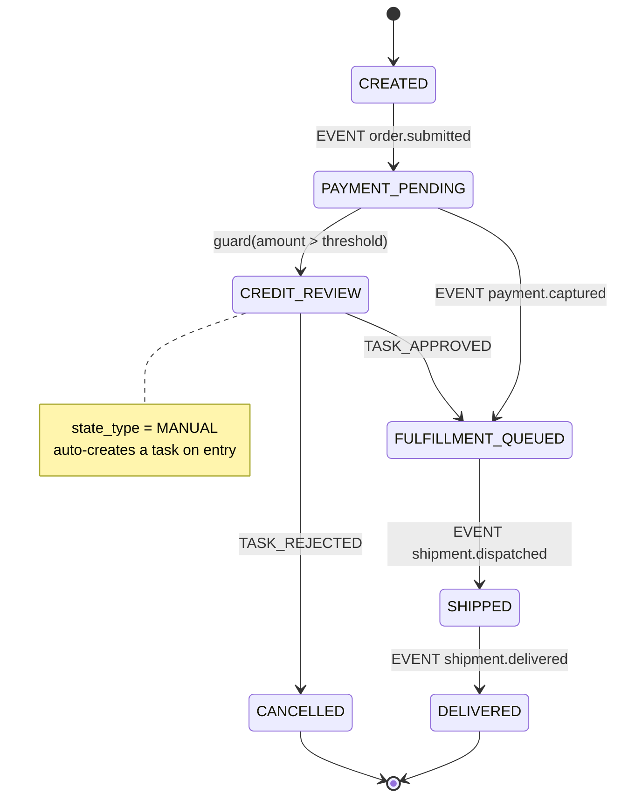

# Order Management System — Technical Specification

## 1. Scope

A standalone OMS with:
- A **core order model** with fixed, typed, indexable fields plus a **schema-validated extension mechanism** for order-type-specific data — no EAV, no migrations for new order types.
- A **configurable workflow engine** (state machine, not hardcoded status enum) driving order lifecycle, versioned independently per order type.
- A **human task queue** for manual workflow steps, with assignment, claim, approve/reject, and escalation.

---

## 2. Design Principles

| Principle | Rationale |
|---|---|
| Core fields are real columns | Indexable, constrainable, queryable without JSON path expressions. |
| Extension fields live in one JSONB column, schema-validated | Avoids EAV join explosion; still gives structure via JSON Schema per order type. |
| `status` is denormalized from the workflow engine | Fast filtering (`WHERE status = ?`) without joining workflow tables on every read. |
| Workflow definitions are versioned and immutable once published | In-flight orders must not be silently affected by a workflow edit. |
| Manual steps are first-class workflow states, not application-level if/else | A "MANUAL" state type generates a task automatically; approve/reject are just transition triggers. |
| Optimistic locking everywhere mutable | Manual task actions and automated transitions can race on the same order. |

---

## 3. Core Domain Model

### 3.1 `order`

| Column | Type | Notes |
|---|---|---|
| order_id | UUID, PK | |
| order_number | VARCHAR(40), UNIQUE | Human-readable, format owned by order_type |
| order_type_code | VARCHAR(50), FK → order_type.code | Discriminator: drives extension schema + workflow. **Immutable after creation** — changing it would orphan the pinned `workflow_instance` and invalidate `attributes` against a different schema. |
| status | VARCHAR(50) | Mirrors `workflow_instance.current_state_code` |
| customer_ref | VARCHAR(100) | External ID, no FK — loose coupling to customer domain |
| currency | CHAR(3) | ISO 4217 |
| total_amount | NUMERIC(18,2) | |
| attributes | JSONB | Validated against `order_type.attribute_schema` on write |
| version | BIGINT | Optimistic lock |
| created_at / updated_at | TIMESTAMPTZ | |
| created_by / updated_by | VARCHAR(100) | |

### 3.2 `order_line`

| Column | Type | Notes |
|---|---|---|
| line_id | UUID, PK | |
| order_id | UUID, FK → order | |
| line_number | INT | Unique per `order_id` (`UNIQUE (order_id, line_number)`) |
| item_ref | VARCHAR(100) | External SKU/item ID |
| quantity | NUMERIC(12,3) | |
| unit_price | NUMERIC(18,2) | |
| line_total | NUMERIC(18,2) | |
| status | VARCHAR(50) | Can diverge from header (partial fulfillment, line-level cancel). **Not driven by a workflow_instance** — see §4.7 for how it's mutated. |
| attributes | JSONB | Line-level extension bag |
| version | BIGINT | |

### 3.3 `order_type` — the extensibility registry

| Column | Type | Notes |
|---|---|---|
| order_type_id | UUID, PK | |
| code | VARCHAR(50), UNIQUE | e.g. `STANDARD`, `SUBSCRIPTION`, `B2B_BULK` |
| name | VARCHAR(100) | |
| attribute_schema | JSONB | JSON Schema — validates `order.attributes` |
| line_attribute_schema | JSONB | JSON Schema — validates `order_line.attributes` |
| workflow_definition_id | UUID, FK → workflow_definition | **Sole source of truth for "the active workflow version"** for this order type. New orders pin their `workflow_instance.workflow_definition_id` from this column at creation time. |
| is_active | BOOLEAN | |

**How extension works:** adding a new order type or new custom fields means inserting/updating a row here — no DDL, no deploy. `attribute_schema` is enforced at the API layer on create/update. Consumers can `GET /order-types/{code}/schema` to introspect available fields instead of hardcoding them client-side.

---

## 4. Workflow Engine Model

Workflow is decoupled from `order` entirely — `order.status` is a read-optimized projection, the tables below are the source of truth.

### 4.1 `workflow_definition`

| Column | Type | Notes |
|---|---|---|
| workflow_definition_id | UUID, PK | |
| order_type_code | VARCHAR(50) | |
| version | INT | Monotonic per order_type_code |
| name | VARCHAR(100) | |
| published_at | TIMESTAMPTZ | Immutable once published |

There is no `is_active` flag on this table. "Active version for an order type" is defined exclusively by `order_type.workflow_definition_id` (§3.3) — having two independently-settable flags (`order_type.workflow_definition_id` *and* a per-row `is_active`) allows them to disagree, which previously made "which version is active" ambiguous. Publishing a new version (`PUT /order-types/{code}/workflow`, §6) inserts a new `workflow_definition` row and updates `order_type.workflow_definition_id` to point at it, atomically, in one transaction. Older rows remain queryable by `order_type_code` + `version` for any `workflow_instance` still pinned to them.

### 4.2 `workflow_state`

| Column | Type | Notes |
|---|---|---|
| state_id | UUID, PK | |
| workflow_definition_id | UUID, FK | |
| code | VARCHAR(50) | e.g. `CREATED`, `CREDIT_REVIEW`, `FULFILLED` |
| state_type | ENUM | `AUTOMATIC` \| `MANUAL` \| `WAIT` |
| is_initial | BOOLEAN | |
| is_terminal | BOOLEAN | |
| default_assignee_group | VARCHAR(100), nullable | Only meaningful when `state_type = MANUAL`. §5.3 step 1 says a task is created with "assignee_group from state config" — this is that config; the original table omitted it. |
| is_customer_visible | BOOLEAN, default FALSE | Drives the Customer Portal timeline (UI spec §3): only states with this set render there. Internal-only states (e.g. `CREDIT_REVIEW`) stay off it. |
| customer_facing_label | VARCHAR(200), nullable | Plain-language status shown to customers, set independently of `code` so internal renames never break customer-facing copy (UI spec §3, §4.2). |
| terminal_outcome | ENUM, nullable | `SUCCESS` \| `FAILURE`. Only set when `is_terminal = TRUE` (enforced by a CHECK constraint) — `is_terminal` alone doesn't say which side of the outcome a terminal state is on (UI spec §6 badge mapping needs this). |
| canvas_x / canvas_y | NUMERIC(10,2), nullable | Workflow Designer node layout (UI spec §4.3) — a pure display hint, no engine meaning. |

- **AUTOMATIC**: a state the engine expects to resolve immediately. On entry, the engine evaluates outbound transitions in `sequence` order (see §4.3) and fires the first one whose `trigger_code` is null (or matches an already-queued signal) and whose `guard_expression` is true or null. A signal (`EVENT`/`API_ACTION`/`TIMER`) arriving later re-runs the same evaluation. A stuck `AUTOMATIC` state (no eligible transition for an extended period) indicates a missing event or engine bug, not expected behavior.
- **MANUAL**: on entry, a `task` row is created automatically (see §5). Exit requires a task decision (`TASK_APPROVED`/`TASK_REJECTED`).
- **WAIT**: behaviorally identical evaluation to `AUTOMATIC` (same guard/trigger matching), but the engine expects an unbounded or long dwell time pending an external signal — e.g. a third-party fulfillment callback. The type exists for operational/monitoring purposes (alerting thresholds, dashboards) rather than different engine logic; unlike `MANUAL`, no `task` is generated.

In short: `AUTOMATIC` and `WAIT` share one evaluation path; they differ only in what dwell time counts as "normal." Only `MANUAL` changes engine behavior (task creation, decision-gated exit).

### 4.3 `workflow_transition`

| Column | Type | Notes |
|---|---|---|
| transition_id | UUID, PK | |
| workflow_definition_id | UUID, FK | |
| from_state_id | UUID, FK → workflow_state | |
| to_state_id | UUID, FK → workflow_state | |
| sequence | INT, default 0 | Evaluation order among multiple outbound transitions sharing `from_state_id`. Lower values evaluated first; the engine fires the first transition (in `sequence` order) whose `trigger_code` matches (or is null) and whose `guard_expression` is true (or null). Resolves the case where more than one outbound transition could be eligible at once. |
| trigger_type | ENUM | `EVENT` \| `API_ACTION` \| `TASK_APPROVED` \| `TASK_REJECTED` \| `TIMER` |
| trigger_code | VARCHAR(50) | e.g. `payment.captured`, `manual.approve`. Nullable — null means "evaluate on entry, no external signal required." |
| guard_expression | TEXT, nullable | Expression (CEL/JSONLogic) evaluated against `{order, attributes}` |
| side_effect | VARCHAR(100), nullable | Identifier for an action to invoke on transition (emits event, calls service) |

A `MANUAL` state typically has exactly two outbound transitions: one `TASK_APPROVED`, one `TASK_REJECTED`, each pointing at a different `to_state_id` (e.g., approve → `FULFILLED`, reject → `CANCELLED` or back to a rework state).

### 4.4 `workflow_instance` (runtime, 1:1 with order)

| Column | Type | Notes |
|---|---|---|
| instance_id | UUID, PK | |
| order_id | UUID, FK → order, UNIQUE | |
| workflow_definition_id | UUID, FK | Pinned at creation — survives later workflow edits |
| current_state_id | UUID, FK → workflow_state | |
| started_at / completed_at | TIMESTAMPTZ | |
| version | BIGINT | Optimistic lock |

### 4.5 `workflow_transition_log` (audit trail, append-only)

| Column | Type | Notes |
|---|---|---|
| log_id | UUID, PK | |
| instance_id | UUID, FK | |
| from_state_code / to_state_code | VARCHAR(50) | |
| trigger_type / trigger_code | | |
| triggered_by | VARCHAR(100) | user ID or `SYSTEM` |
| comment | TEXT, nullable | |
| occurred_at | TIMESTAMPTZ | |

### 4.6 State diagram (example: STANDARD order type)

All states other than `CREDIT_REVIEW` are `state_type = AUTOMATIC` here: `PAYMENT_PENDING` has two outbound transitions evaluated by `sequence` — the guard-only `CREDIT_REVIEW` transition (no `trigger_code`, evaluated immediately on entry) and the `EVENT payment.captured` transition, which fires only if the guard transition didn't. This example doesn't use `WAIT` because none of its states expect an unbounded dwell with no SLA semantics; a state like `AWAITING_3RD_PARTY_FULFILLMENT` (blocked on an external system with no internal timeout) would be a typical `WAIT` candidate.

### 4.7 Line-level status (outside the workflow engine)

`order_line.status` is **not** backed by its own `workflow_instance` — only the order header has one (§4.4, 1:1 with `order`). Modeling a separate state machine per line would multiply the number of running instances per order and most line-level transitions (partial ship, line cancel) are side effects of header-level events, not independent decision points. Instead:

- Line status changes are driven by `side_effect` handlers attached to header-level `workflow_transition` rows (e.g., a `shipment.dispatched` event that only ships a subset of lines updates just those `order_line` rows), or
- By direct line-mutation API calls (`PATCH /orders/{id}/lines/{lineId}`), independently optimistic-locked via `order_line.version`.

If a future order type needs genuinely independent per-line approval workflows (e.g., line-level credit hold), treat each line as its own pseudo-order with its own `workflow_instance` rather than overloading this column — that's a deliberate non-goal for the current model.

---

## 5. Manual Task / Human Task Queue

### 5.1 `task`

| Column | Type | Notes |
|---|---|---|
| task_id | UUID, PK | |
| order_id | UUID, FK | |
| workflow_instance_id | UUID, FK | |
| state_id | UUID, FK → workflow_state | The MANUAL state this task corresponds to |
| task_type | VARCHAR(50) | e.g. `CREDIT_REVIEW`, `FRAUD_CHECK` |
| status | ENUM | `UNASSIGNED` \| `ASSIGNED` \| `IN_PROGRESS` \| `APPROVED` \| `REJECTED` \| `ESCALATED` \| `CANCELLED` |
| assignee_id | VARCHAR(100), nullable | |
| assignee_group | VARCHAR(100), nullable | Queue/role, e.g. `fraud-team` — supports push or pull assignment |
| priority | SMALLINT | |
| sla_due_at | TIMESTAMPTZ, nullable | |
| decision | ENUM, nullable | `APPROVE` \| `REJECT` |
| decision_reason | TEXT, nullable | |
| decision_by | VARCHAR(100), nullable | |
| escalation_reason | TEXT, nullable | Set on escalate — by a manual override (UI spec §2.4, required from that path) or the SLA sweep job (step 4 below, which fills in a system-generated reason). Distinct from `decision_reason`, which is APPROVE/REJECT-specific. |
| created_at / claimed_at / completed_at | TIMESTAMPTZ | |
| version | BIGINT | |

### 5.2 `task_comment`

| Column | Type | Notes |
|---|---|---|
| comment_id | UUID, PK | |
| task_id | UUID, FK | |
| author_id | VARCHAR(100) | |
| body | TEXT | |
| created_at | TIMESTAMPTZ | |

### 5.3 Lifecycle

1. Workflow engine enters a `MANUAL` state → creates `task` (`status = UNASSIGNED`, `assignee_group` from state config).
2. Pull: any member of `assignee_group` calls `claim` → `status = ASSIGNED`, `assignee_id` set. Push: a lead calls `assign` directly to a user.
3. Worker calls `approve` or `reject` (with reason) → fires the matching `TASK_APPROVED`/`TASK_REJECTED` transition on the workflow instance, which moves `current_state_id`, updates `order.status`, and writes a `workflow_transition_log` row.
4. SLA breach (`sla_due_at` passed, still not `APPROVED`/`REJECTED`) → background job sets `status = ESCALATED`, reassigns per escalation policy, emits `task.escalated`.

---

## 6. API Surface

### Orders

| Method | Path | Purpose |
|---|---|---|
| POST | `/orders` | Create order; validates `attributes` against `order_type.attribute_schema` |
| GET | `/orders/{id}` | Fetch order + lines |
| GET | `/orders?status=&order_type=&customer_ref=&created_from=&created_to=&has_open_task=` | List/filter. `status` and `order_type` are multi-select (repeat the param or comma-separate); `has_open_task` filters on whether any non-terminal `task` exists for the order — needed for the Ops order list's toggle (UI spec §2.1). |
| PATCH | `/orders/{id}` | Update core fields/attributes; requires `If-Match: version` |
| POST | `/orders/{id}/lines` | Add line |
| PATCH | `/orders/{id}/lines/{lineId}` | Update line |

### Order Types

| Method | Path | Purpose |
|---|---|---|
| GET | `/order-types` | List active types |
| GET | `/order-types/{code}/schema` | Returns `attribute_schema`, `line_attribute_schema`, active workflow summary |
| POST | `/order-types` | Register new type (admin) |
| PATCH | `/order-types/{code}` | `{attribute_schema?, line_attribute_schema?}` — extends an existing type's schema (either field optional, independently updatable). Enforces §3.3's "no DDL, no deploy" promise for fields added *after* the type already exists, not just at creation. Never retroactively validates already-stored `order.attributes` against the new schema. |
| PUT | `/order-types/{code}/workflow` | Publish a new workflow version: inserts a new `workflow_definition` row, then updates `order_type.workflow_definition_id` to point at it — both in one transaction (§4.1). In-flight `workflow_instance` rows keep their previously pinned `workflow_definition_id`. Rejects the publish (`400`) unless: every state is reachable from the initial state, every non-terminal state has at least one outbound transition, and every `MANUAL` state has both a `TASK_APPROVED` and a `TASK_REJECTED` transition — this is what backs the Workflow Designer's "Publish disabled until validation passes" (UI spec §4.3) so a direct API call can't bypass it either. |

### Workflow

| Method | Path | Purpose |
|---|---|---|
| GET | `/orders/{id}/workflow` | Current state, valid next transitions, full history |
| POST | `/orders/{id}/workflow/transitions` | Fire an `EVENT`/`API_ACTION` transition: `{trigger_code, payload}` |
| GET | `/workflow-definitions/{id}` | States + transitions for a definition version |

### Tasks

| Method | Path | Purpose |
|---|---|---|
| GET | `/tasks?status=UNASSIGNED&assignee_group=&order_type=&assignee_id=&priority=` | Queue view. `assignee_id` backs the Ops "My tasks" toggle (UI spec §2.3). |
| GET | `/tasks/{id}` | Task detail + comments |
| POST | `/tasks/{id}/claim` | Self-assign |
| POST | `/tasks/{id}/assign` | `{assignee_id}` — assign to a user |
| POST | `/tasks/{id}/approve` | `{comment}` — fires `TASK_APPROVED` |
| POST | `/tasks/{id}/reject` | `{reason}` — fires `TASK_REJECTED` |
| POST | `/tasks/{id}/escalate` | `{reason}` (required, `400` if blank) — manual escalation override, distinct from the automatic SLA-breach escalation in §5.3 step 4, which fills in its own system-generated reason |
| POST | `/tasks/{id}/comments` | Add comment |

All mutating endpoints require `version`/`If-Match` for optimistic concurrency and return `409 Conflict` on mismatch.

---

## 7. Emitted Events

`order.created` · `order.updated` · `order.status_changed` · `workflow.transitioned` · `task.created` · `task.assigned` · `task.approved` · `task.rejected` · `task.escalated`

Each event payload carries `order_id`, `order_type_code`, `from_state`/`to_state` (where applicable), `occurred_at`, and `triggered_by`.

### 7.1 Event delivery — transactional outbox

Emitting events as a separate publish step alongside the DB transaction in §8 is a dual-write hazard: the state mutation can commit while the publish fails (or vice versa), silently losing or duplicating an event. Events are instead written to an outbox table in the **same transaction** as the state change they describe:

#### `domain_event`

| Column | Type | Notes |
|---|---|---|
| event_id | UUID, PK | |
| event_type | VARCHAR(50) | e.g. `order.created`, `workflow.transitioned` |
| aggregate_type | VARCHAR(50) | `ORDER` \| `WORKFLOW_INSTANCE` \| `TASK` |
| aggregate_id | UUID | |
| payload | JSONB | |
| occurred_at | TIMESTAMPTZ | |
| published_at | TIMESTAMPTZ, nullable | Null until a publisher confirms delivery to the broker |

A separate publisher process polls `WHERE published_at IS NULL` (or taps the table via CDC, e.g. Debezium) and dispatches rows to the message bus, then sets `published_at`. This guarantees at-least-once delivery without coupling the transition handler to broker availability. Consumers must dedupe on `event_id`, since at-least-once means occasional redelivery.

---

## 8. Concurrency & Consistency Notes

- `order.version`, `workflow_instance.version`, and `task.version` are independent optimistic locks — a task approval touches all three and inserts the corresponding `domain_event` row (§7.1), all within a single DB transaction.
- `order.status` is written **only** by the transition handler, never directly via `PATCH /orders/{id}` — prevents status drifting out of sync with the workflow engine.
- Workflow definitions are immutable post-publish; an in-flight `workflow_instance` keeps its pinned `workflow_definition_id` even after a new version goes active (i.e., even after `order_type.workflow_definition_id` is repointed, §4.1). New orders of that type pick up the new version on creation.

## 9. Open Extension Points (intentionally unspecified here)

- Guard expression language choice (CEL vs JSONLogic vs custom DSL).
- Escalation policy configuration (single table vs rules engine).
- Multi-tenancy column (`tenant_id`) — omitted since this spec targets a standalone deployment; trivial to add as a leading composite-index column if needed later.
