# Order Management System — Technical Documentation

> Companion to [SPEC.md](SPEC.md), [UI-SPEC.md](UI-SPEC.md), and [GUIDE.md](GUIDE.md).
> This document covers system architecture, data model, service internals, all API
> endpoints, and end-to-end sequence diagrams for every major flow.

---

## Table of Contents

1. [System Overview](#1-system-overview)
2. [Technology Stack](#2-technology-stack)
3. [Project Layout](#3-project-layout)
4. [Data Model](#4-data-model)
5. [Backend Architecture](#5-backend-architecture)
6. [API Reference](#6-api-reference)
7. [Sequence Diagrams](#7-sequence-diagrams)
   - 7.1 [Order Creation](#71-order-creation)
   - 7.2 [Workflow Transition (Event / API Action)](#72-workflow-transition-event--api-action)
   - 7.3 [Low-Value Order — Full Automated Lifecycle](#73-low-value-order--full-automated-lifecycle)
   - 7.4 [High-Value Order — Guard → Manual Review](#74-high-value-order--guard--manual-review)
   - 7.5 [Task Claim and Approve](#75-task-claim-and-approve)
   - 7.6 [Task Reject](#76-task-reject)
   - 7.7 [Task Escalation (Manual)](#77-task-escalation-manual)
   - 7.8 [SLA Sweep — Automatic Escalation](#78-sla-sweep--automatic-escalation)
   - 7.9 [Publish Workflow Definition](#79-publish-workflow-definition)
   - 7.10 [Optimistic Lock Conflict](#710-optimistic-lock-conflict)
   - 7.11 [Transactional Outbox — Event Delivery](#711-transactional-outbox--event-delivery)
   - 7.12 [Order Schema Extension (PATCH)](#712-order-schema-extension-patch)
8. [Workflow Engine Deep Dive](#8-workflow-engine-deep-dive)
9. [Human Task Queue](#9-human-task-queue)
10. [Event System](#10-event-system)
11. [Frontend Architecture](#11-frontend-architecture)
12. [Concurrency & Consistency](#12-concurrency--consistency)

---

## 1. System Overview

The OMS is a self-contained order management system composed of three concerns:

| Concern | Description |
|---|---|
| **Order model** | Fixed typed columns (`order_id`, `total_amount`, etc.) plus a schema-validated JSONB extension bag (`attributes`) per order type — no EAV, no migrations for new fields. |
| **Workflow engine** | A configurable state machine (not a hardcoded status enum). Each order type carries its own versioned `workflow_definition`; every order gets a pinned `workflow_instance` that runs independently of later definition changes. |
| **Human task queue** | `MANUAL` workflow states automatically generate tasks. Agents claim, approve, or reject tasks; decisions are translated back into workflow transition triggers. |

```
┌─────────────────────────────────────────────────────────────────────────────┐
│                              React Frontend                                  │
│  ┌──────────────┐  ┌──────────────┐  ┌────────────────┐  ┌──────────────┐ │
│  │  Ops Console │  │ Task Queue   │  │  Admin Console │  │ Customer     │ │
│  │  /ops/orders │  │ /ops/tasks   │  │ /admin/order-  │  │ Portal       │ │
│  │              │  │              │  │  types         │  │ /track/:id   │ │
│  └──────┬───────┘  └──────┬───────┘  └───────┬────────┘  └──────┬───────┘ │
└─────────┼─────────────────┼──────────────────┼─────────────────┼───────────┘
          │  HTTP / Vite proxy (:5173 → :8080)  │                 │
          ▼                 ▼                   ▼                 ▼
┌─────────────────────────────────────────────────────────────────────────────┐
│                          Spring Boot REST API (:8080)                        │
│  ┌──────────────┐  ┌──────────────┐  ┌────────────────┐  ┌──────────────┐ │
│  │ OrderCtrl    │  │ TaskCtrl     │  │ OrderTypeCtrl  │  │ WorkflowCtrl │ │
│  └──────┬───────┘  └──────┬───────┘  └───────┬────────┘  └──────┬───────┘ │
│         │                 │                   │                   │         │
│  ┌──────▼───────┐  ┌──────▼───────┐  ┌───────▼────────┐         │         │
│  │ OrderService │  │ TaskService  │  │ OrderTypeService│         │         │
│  └──────┬───────┘  └──────┬───────┘  └────────────────┘         │         │
│         │                 │                                        │         │
│         └──────────┬──────┘ ──────────────────────────────────────┘         │
│                    ▼                                                          │
│         ┌──────────────────────┐   ┌───────────────────┐                    │
│         │ WorkflowEngineService│   │ EventOutboxService│                    │
│         │  + GuardEvaluator    │   │                   │                    │
│         └──────────┬───────────┘   └─────────┬─────────┘                   │
└────────────────────┼──────────────────────────┼────────────────────────────┘
                     │  JPA / Spring Data        │
                     ▼                           ▼
              ┌─────────────────────────────────────────┐
              │         PostgreSQL 16 (:5432)            │
              │  order, order_line, order_type,          │
              │  workflow_definition/state/transition,   │
              │  workflow_instance, workflow_transition_ │
              │  log, task, task_comment, domain_event   │
              └─────────────────────────────────────────┘
```

---

## 2. Technology Stack

| Layer | Technology |
|---|---|
| **Backend runtime** | Java 21, Spring Boot 3 |
| **Persistence** | PostgreSQL 16, Spring Data JPA / Hibernate, Flyway migrations |
| **Guard evaluation** | JSON Logic (safe-by-construction, no arbitrary code execution) |
| **Schema validation** | JSON Schema (via `JsonSchemaValidationService`) |
| **API docs** | SpringDoc / OpenAPI 3 — auto-generated, Swagger UI at `/swagger-ui/index.html` |
| **Frontend** | React 18, TypeScript, Vite (dev proxy to `:8080`) |
| **Testing** | JUnit 5, Testcontainers (Postgres) for integration tests |
| **Containerization** | Docker Compose (Postgres for local dev) |

---

## 3. Project Layout

```
OMS/
├── src/main/java/com/oms/
│   ├── OmsApplication.java
│   ├── config/           OpenApiConfig
│   ├── domain/
│   │   ├── event/        DomainEvent, AggregateType
│   │   ├── order/        Order, OrderLine, OrderType
│   │   ├── task/         Task, TaskComment, TaskDecision, TaskStatus
│   │   └── workflow/     WorkflowDefinition, WorkflowState, WorkflowTransition,
│   │                     WorkflowInstance, WorkflowTransitionLog,
│   │                     StateType, TriggerType, TerminalOutcome, BadgeCategory
│   ├── exception/        ConflictException, NotFoundException
│   ├── repository/       One Spring Data repo per aggregate root
│   ├── service/
│   │   ├── OrderService.java
│   │   ├── OrderTypeService.java
│   │   ├── TaskService.java
│   │   ├── WorkflowEngineService.java
│   │   ├── EventOutboxService.java
│   │   ├── DomainEventPublisher.java
│   │   ├── guard/        GuardEvaluator (JSON Logic)
│   │   └── validation/   JsonSchemaValidationService, SchemaValidationException
│   └── web/
│       ├── GlobalExceptionHandler.java
│       ├── OrderController.java
│       ├── OrderTypeController.java
│       ├── TaskController.java
│       ├── WorkflowController.java
│       └── dto/          OrderDtos, OrderTypeDtos, TaskDtos, WorkflowDtos
├── src/main/resources/
│   ├── application.properties
│   └── db/migration/     Flyway SQL migrations (V1__*, V2__*, ...)
├── src/test/java/com/oms/
│   └── OrderWorkflowIT.java  (Testcontainers integration test)
├── web/                  React frontend (Vite)
│   └── src/
│       ├── admin/        OrderTypeEditorPage, OrderTypeListPage,
│       │                 WorkflowDesignerPage, SchemaBuilder, workflowGraph
│       ├── api/          orders.ts, tasks.ts, orderTypes.ts, workflow.ts
│       ├── components/   StatusBadge, SlaBadge, DynamicSchemaForm, Pagination, …
│       ├── customer/     OrderTrackingPage
│       ├── hooks/        useStatusTaxonomy
│       ├── layout/       OpsAdminLayout, CustomerLayout
│       ├── lib/          api.ts (fetch wrapper), actingUser, badgeColors
│       └── ops/          OrderListPage, OrderDetailPage, OrderCreatePage,
│                         TaskDetailPage, TaskQueuePage
├── docker-compose.yml
├── pom.xml
├── README.md, SPEC.md, UI-SPEC.md, GUIDE.md
└── TECHNICAL.md          (this file)
```

---

## 4. Data Model

### Entity Relationship Diagram

```mermaid
erDiagram
    ORDER_TYPE {
        UUID order_type_id PK
        VARCHAR code UK
        VARCHAR name
        JSONB attribute_schema
        JSONB line_attribute_schema
        UUID workflow_definition_id FK
        BOOLEAN is_active
    }

    ORDER {
        UUID order_id PK
        VARCHAR order_number UK
        VARCHAR order_type_code FK
        VARCHAR status
        VARCHAR customer_ref
        CHAR currency
        NUMERIC total_amount
        JSONB attributes
        BIGINT version
        TIMESTAMPTZ created_at
        TIMESTAMPTZ updated_at
        VARCHAR created_by
        VARCHAR updated_by
    }

    ORDER_LINE {
        UUID line_id PK
        UUID order_id FK
        INT line_number
        VARCHAR item_ref
        NUMERIC quantity
        NUMERIC unit_price
        NUMERIC line_total
        VARCHAR status
        JSONB attributes
        BIGINT version
    }

    WORKFLOW_DEFINITION {
        UUID workflow_definition_id PK
        VARCHAR order_type_code
        INT version
        VARCHAR name
        TIMESTAMPTZ published_at
    }

    WORKFLOW_STATE {
        UUID state_id PK
        UUID workflow_definition_id FK
        VARCHAR code
        ENUM state_type
        BOOLEAN is_initial
        BOOLEAN is_terminal
        VARCHAR default_assignee_group
        BOOLEAN is_customer_visible
        VARCHAR customer_facing_label
        ENUM terminal_outcome
        NUMERIC canvas_x
        NUMERIC canvas_y
    }

    WORKFLOW_TRANSITION {
        UUID transition_id PK
        UUID workflow_definition_id FK
        UUID from_state_id FK
        UUID to_state_id FK
        INT sequence
        ENUM trigger_type
        VARCHAR trigger_code
        TEXT guard_expression
        VARCHAR side_effect
    }

    WORKFLOW_INSTANCE {
        UUID instance_id PK
        UUID order_id FK
        UUID workflow_definition_id FK
        UUID current_state_id FK
        TIMESTAMPTZ started_at
        TIMESTAMPTZ completed_at
        BIGINT version
    }

    WORKFLOW_TRANSITION_LOG {
        UUID log_id PK
        UUID instance_id FK
        VARCHAR from_state_code
        VARCHAR to_state_code
        ENUM trigger_type
        VARCHAR trigger_code
        VARCHAR triggered_by
        TEXT comment
        TIMESTAMPTZ occurred_at
    }

    TASK {
        UUID task_id PK
        UUID order_id FK
        UUID workflow_instance_id FK
        UUID state_id FK
        VARCHAR task_type
        ENUM status
        VARCHAR assignee_id
        VARCHAR assignee_group
        SMALLINT priority
        TIMESTAMPTZ sla_due_at
        ENUM decision
        TEXT decision_reason
        VARCHAR decision_by
        TEXT escalation_reason
        TIMESTAMPTZ created_at
        TIMESTAMPTZ claimed_at
        TIMESTAMPTZ completed_at
        BIGINT version
    }

    TASK_COMMENT {
        UUID comment_id PK
        UUID task_id FK
        VARCHAR author_id
        TEXT body
        TIMESTAMPTZ created_at
    }

    DOMAIN_EVENT {
        UUID event_id PK
        VARCHAR event_type
        ENUM aggregate_type
        UUID aggregate_id
        JSONB payload
        TIMESTAMPTZ occurred_at
        TIMESTAMPTZ published_at
    }

    ORDER_TYPE ||--o{ ORDER : "order_type_code"
    ORDER_TYPE ||--o| WORKFLOW_DEFINITION : "workflow_definition_id (active version)"
    ORDER ||--o{ ORDER_LINE : "order_id"
    ORDER ||--|| WORKFLOW_INSTANCE : "order_id"
    WORKFLOW_DEFINITION ||--o{ WORKFLOW_STATE : "workflow_definition_id"
    WORKFLOW_DEFINITION ||--o{ WORKFLOW_TRANSITION : "workflow_definition_id"
    WORKFLOW_STATE ||--o{ WORKFLOW_TRANSITION : "from_state_id"
    WORKFLOW_STATE ||--o{ WORKFLOW_TRANSITION : "to_state_id"
    WORKFLOW_INSTANCE ||--|| WORKFLOW_STATE : "current_state_id"
    WORKFLOW_INSTANCE ||--|| WORKFLOW_DEFINITION : "workflow_definition_id (pinned)"
    WORKFLOW_INSTANCE ||--o{ WORKFLOW_TRANSITION_LOG : "instance_id"
    ORDER ||--o{ TASK : "order_id"
    WORKFLOW_INSTANCE ||--o{ TASK : "workflow_instance_id"
    WORKFLOW_STATE ||--o{ TASK : "state_id"
    TASK ||--o{ TASK_COMMENT : "task_id"
```

### Key Schema Decisions

| Decision | Rationale |
|---|---|
| `order.status` denormalized from workflow | Fast `WHERE status = ?` filtering without joining workflow tables on every read. Only `WorkflowEngineService` writes it. |
| `order_type.workflow_definition_id` as sole "active version" pointer | Eliminates the dual-flag ambiguity of having both a FK and a per-row `is_active`. Publishing atomically repoints this FK. |
| `workflow_instance.workflow_definition_id` pinned at creation | In-flight orders are never silently affected by a new workflow version. |
| `attributes` / `line_attributes` as JSONB | Avoids EAV join explosion; new fields are schema changes, not DDL migrations. |
| Optimistic locks (`version` BIGINT) on `order`, `workflow_instance`, `task`, `order_line` | Concurrent task decisions and automated transitions can race on the same order; each lock is independent (SPEC.md §8). |

### Why `attributes` lives in the same `order` row (not a separate table)

The alternative is an **EAV (Entity-Attribute-Value)** table — a classic pattern that looks like this:

```
order_attribute
  order_id  │  key          │  value
────────────┼───────────────┼─────────
  uuid-1    │  giftMessage  │  "hi"
  uuid-1    │  creditScore  │  "720"
  uuid-2    │  giftMessage  │  "happy bday"
```

EAV has three structural problems that the JSONB column avoids:

**1. Join explosion on every read.** Fetching one order with 5 attributes requires 5 joined rows that must be pivoted back into a map in application code. At any scale this becomes expensive and verbose. The JSONB column returns a single row — no joins, no pivots.

**2. All values become strings.** EAV tables store everything as `VARCHAR`. You lose type fidelity: comparing `"720" > "70"` as strings gives the wrong answer. Encoding and decoding types yourself is fragile and not enforced by the DB. JSONB preserves types natively — numbers are numbers, booleans are booleans.

**3. Schema is implicit and unenforced.** An EAV table has no way to express "a `STANDARD` order must have a `creditScore` field of type `number`" vs. "a `SUBSCRIPTION` order has a `billingCycleDay` field of type `integer`." Any key can appear against any order and the DB cannot reject it. With JSONB, `order_type.attribute_schema` holds a JSON Schema per order type, and `JsonSchemaValidationService` validates every write against it — invalid attributes are rejected with `400` at the API boundary.

**The accepted tradeoff:** JSONB fields are not individually indexed by default, so `WHERE attributes->>'creditScore' > '700'` is a sequential scan unless you add a specific expression index. This is acceptable here because the fields that need to be fast-filtered (`status`, `customer_ref`, `total_amount`, `order_type_code`) are all real columns. Attribute values are context the order carries for its workflow and task reviewers — they are read per-order, not used in large cross-order aggregations.

The two tiers serve different purposes: **real columns for what the system queries on, JSONB for what the order type owns and the system passes through.**

### JSONB in the same row vs. JSONB in a separate table

A subtler alternative to EAV is keeping JSONB but moving it to a dedicated side table:

```sql
-- option A: current design
orders
  order_id     UUID
  status       VARCHAR
  total_amount NUMERIC
  attributes   JSONB

-- option B: side table
orders
  order_id     UUID
  status       VARCHAR
  total_amount NUMERIC

order_attributes
  order_id     UUID FK
  attributes   JSONB
```

Both options avoid the EAV problems above (type fidelity is preserved, schema is enforced at the app layer either way, GIN indexing is available either way). The difference is purely physical:

| Dimension | Same row (current) | Side table |
|---|---|---|
| **Read** | Single row fetch, zero joins | Always a `LEFT JOIN` on every order fetch |
| **Write** | One `INSERT`/`UPDATE` | Two writes — must be wrapped in a transaction to stay atomic |
| **Atomicity** | Order + attributes always commit together | Requires explicit transaction; two rows can drift if not handled carefully |
| **Heap size** | `attributes` blob inflates the orders heap page | Orders heap stays lean; blob lives in a separate heap |
| **TOAST** | Postgres moves large blobs out-of-line automatically once they exceed ~2 KB | Same TOAST behaviour applies to the side table's JSONB column |

**The only real argument for a side table is heap pressure.** If `attributes` were routinely several kilobytes, keeping it inline would inflate the orders heap page, which hurts sequential scans and index lookups on `status`, `order_type_code`, and other columns that are filtered constantly. A side table keeps those rows tight.

In practice, Postgres TOAST already neutralises this. Once `attributes` exceeds ~2 KB it is compressed and moved out-of-line regardless — the main heap row stores only a pointer. The physical separation the side table offers is therefore obtained automatically, without the join.

**For this codebase the values are small** — a handful of order-type-specific fields (`giftMessage`, `priorityShipping`, `creditScore`). TOAST never triggers. The side table would add a join on every read and a second write on every mutation, for no benefit.

**What a side table cannot solve either.** If per-attribute change history is ever needed (e.g. tracking that `creditScore` changed from 680 to 720 on a specific date), neither a same-row JSONB column nor a JSONB side table can provide it — the whole blob is overwritten on each update. That would require a separate audit/history table with one row per attribute change, which is a different design (closer to event sourcing) and outside the current scope.

---

## 5. Backend Architecture

### Service Layer Dependency Graph

```
OrderController
    └── OrderService
            ├── OrderTypeService         (validates schema, resolves order type)
            ├── WorkflowEngineService    (starts instance, fires transitions)
            ├── JsonSchemaValidationService
            └── EventOutboxService       (records domain events)

TaskController
    └── TaskService
            ├── WorkflowEngineService    (fires TASK_APPROVED / TASK_REJECTED)
            └── EventOutboxService

OrderTypeController
    └── OrderTypeService
            ├── WorkflowDefinitionRepository
            ├── WorkflowStateRepository
            └── WorkflowTransitionRepository

WorkflowController
    └── WorkflowEngineService / repositories (read-only)
```

**Circular dependency avoidance:** `WorkflowEngineService` depends directly on `TaskRepository` (not `TaskService`) so that `TaskService → WorkflowEngineService` stays unidirectional. `TaskService` calls back into the engine on approve/reject; a two-way service dependency would create a circular Spring bean graph.

### Guard Evaluation

```
GuardEvaluator.evaluate(guardExpression, context)
    context = { "order": { orderId, orderNumber, orderTypeCode, status,
                           customerRef, currency, totalAmount, attributes } }

    null expression  → always true (transition is unconditional)
    JSON Logic expr  → evaluated against context, must return boolean
    Example:  {">": [{"var": "order.totalAmount"}, 1000]}  → true when amount > 1000
```

### Auto-Progress (chained transitions)

After every `startInstance`, `fireTrigger`, or `fireTaskDecision`, the engine calls `runAutoProgress`:

```
loop (up to MAX_AUTO_PROGRESS_HOPS = 50):
    if current state is terminal or MANUAL → stop
    find first outbound transition where:
        trigger_code IS NULL   (no external signal required)
        AND guard passes
    if found → applyTransition("SYSTEM") → continue loop
    else → stop
```

This is how guard-only branches work: a state with two outbound null-trigger transitions with opposing guards fires the matching one immediately on entry, without waiting for an external event.

---

## 6. API Reference

### Orders

| Method | Path | Auth header | Request | Response | Status |
|---|---|---|---|---|---|
| `POST` | `/orders` | `X-User-Id` | `{orderTypeCode, customerRef, currency, totalAmount, attributes?, lines?}` | `OrderResponse` | 201 |
| `GET` | `/orders/{id}` | — | — | `OrderResponse` (with lines) | 200 |
| `GET` | `/orders` | — | Query: `status[]`, `orderType[]`, `customerRef`, `createdFrom`, `createdTo`, `hasOpenTask`, Pageable | `Page<OrderResponse>` | 200 |
| `PATCH` | `/orders/{id}` | `X-User-Id`, `If-Match: <version>` | `{customerRef?, currency?, totalAmount?, attributes?}` | `OrderResponse` | 200 / 409 |
| `POST` | `/orders/{id}/lines` | — | `{itemRef, quantity, unitPrice, attributes?}` | `OrderLineResponse` | 201 |
| `PATCH` | `/orders/{id}/lines/{lineId}` | `If-Match: <version>` | `{quantity?, unitPrice?, status?, attributes?}` | `OrderLineResponse` | 200 / 409 |

### Workflow

| Method | Path | Request | Response | Status |
|---|---|---|---|---|
| `GET` | `/orders/{id}/workflow` | — | Current state, valid next transitions, full history | 200 |
| `POST` | `/orders/{id}/workflow/transitions` | `{triggerType, triggerCode}` | Updated workflow summary | 200 / 409 |
| `GET` | `/workflow-definitions/{id}` | — | States + transitions for a specific version | 200 |

### Order Types

| Method | Path | Request | Response | Status |
|---|---|---|---|---|
| `GET` | `/order-types` | — | `List<OrderTypeResponse>` | 200 |
| `GET` | `/order-types/status-taxonomy` | — | `Map<statusCode, badgeCategory>` across all active types | 200 |
| `GET` | `/order-types/{code}/schema` | — | `{attributeSchema, lineAttributeSchema, workflowSummary}` | 200 |
| `POST` | `/order-types` | `{code, name, attributeSchema, lineAttributeSchema}` | `OrderTypeResponse` | 201 |
| `PATCH` | `/order-types/{code}` | `{attributeSchema?, lineAttributeSchema?}` | `OrderTypeResponse` | 200 |
| `PUT` | `/order-types/{code}/workflow` | `{name, states[], transitions[]}` | `WorkflowDefinitionResponse` | 201 / 400 |

### Tasks

| Method | Path | Auth header | Request | Response | Status |
|---|---|---|---|---|---|
| `GET` | `/tasks` | — | Query: `status`, `assigneeGroup`, `orderType`, `assigneeId`, `priority`, `orderId`, Pageable | `Page<TaskResponse>` | 200 |
| `GET` | `/tasks/{id}` | — | — | `TaskResponse` | 200 |
| `GET` | `/tasks/{id}/comments` | — | — | `List<TaskCommentResponse>` | 200 |
| `POST` | `/tasks/{id}/comments` | `X-User-Id` | `{body}` | `TaskCommentResponse` | 201 |
| `POST` | `/tasks/{id}/claim` | `X-User-Id`, `If-Match` | — | `TaskResponse` | 200 / 409 |
| `POST` | `/tasks/{id}/assign` | `If-Match` | `{assigneeId}` | `TaskResponse` | 200 / 409 |
| `POST` | `/tasks/{id}/approve` | `X-User-Id`, `If-Match` | `{comment?}` | `TaskResponse` | 200 / 409 |
| `POST` | `/tasks/{id}/reject` | `X-User-Id`, `If-Match` | `{reason}` | `TaskResponse` | 200 / 409 |
| `POST` | `/tasks/{id}/escalate` | `X-User-Id`, `If-Match` | `{reason}` (required — 400 if blank) | `TaskResponse` | 200 / 400 / 409 |

### Error Responses

| HTTP Status | Trigger |
|---|---|
| 400 Bad Request | Schema validation failure, blank escalation reason, invalid workflow graph on publish |
| 404 Not Found | Unknown order/task/order-type ID or code |
| 409 Conflict | Optimistic lock version mismatch (`If-Match` header doesn't match stored `version`), transition not valid from current state, workflow already completed |

---

## 7. Sequence Diagrams

### 7.1 Order Creation

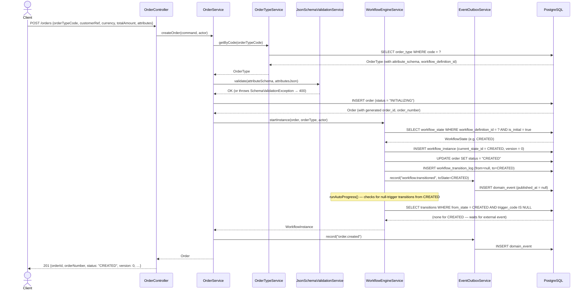

---

### 7.2 Workflow Transition (Event / API Action)

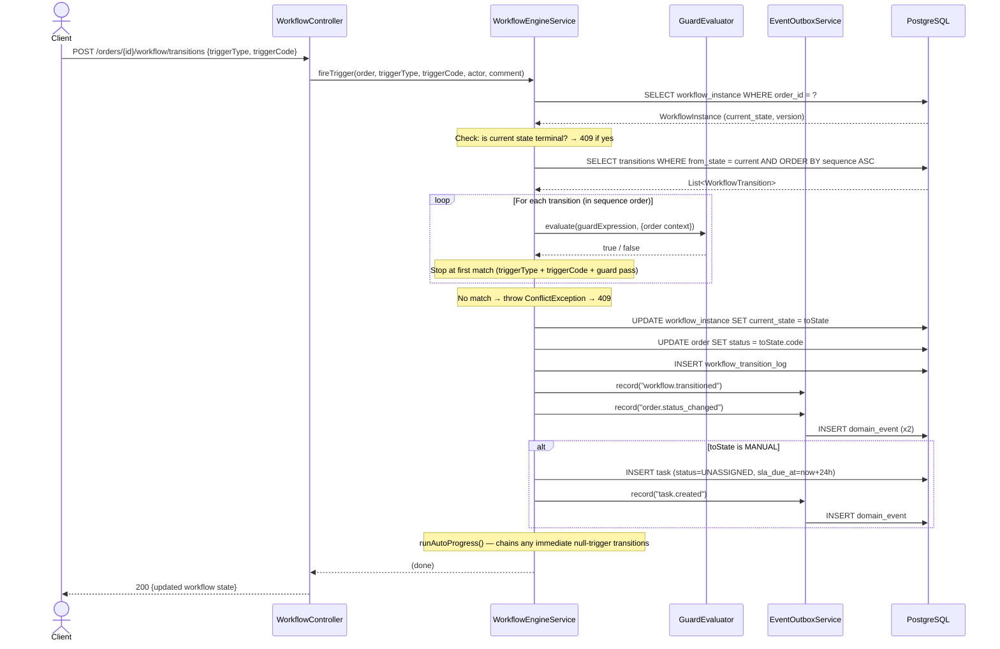

---

### 7.3 Low-Value Order — Full Automated Lifecycle

A STANDARD order under $1,000 skips credit review; all transitions are EVENT-triggered.

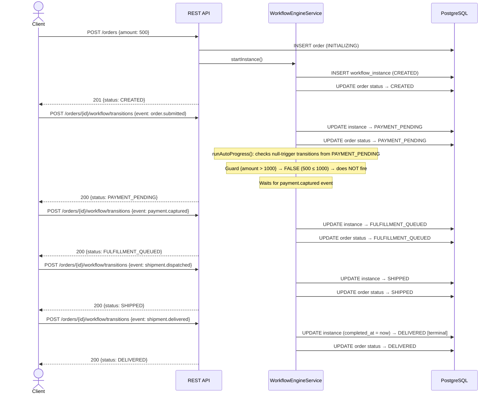

---

### 7.4 High-Value Order — Guard → Manual Review

A STANDARD order over $1,000: after `order.submitted`, auto-progress fires the guard-only transition to `CREDIT_REVIEW` and creates a task.

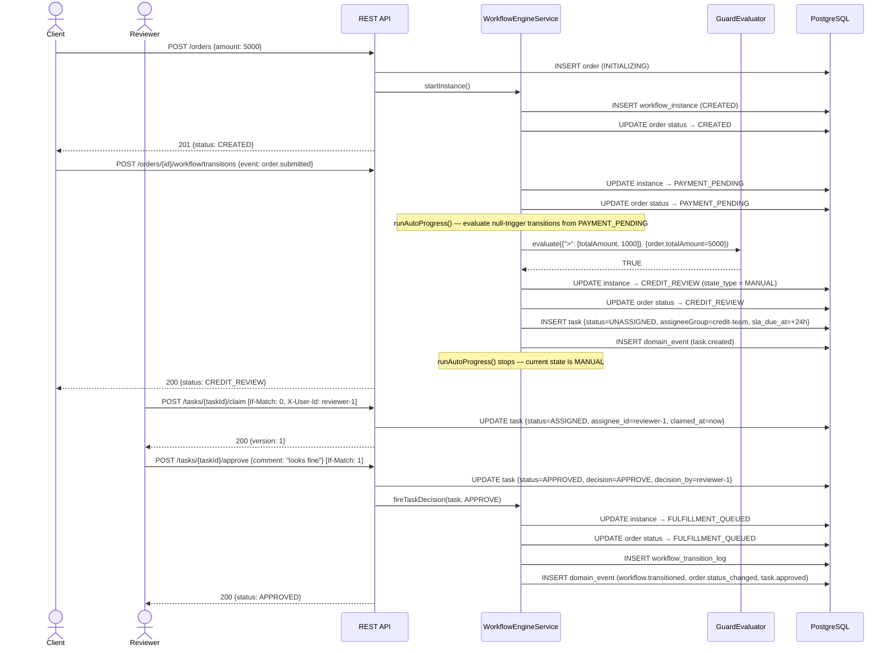

---

### 7.5 Task Claim and Approve

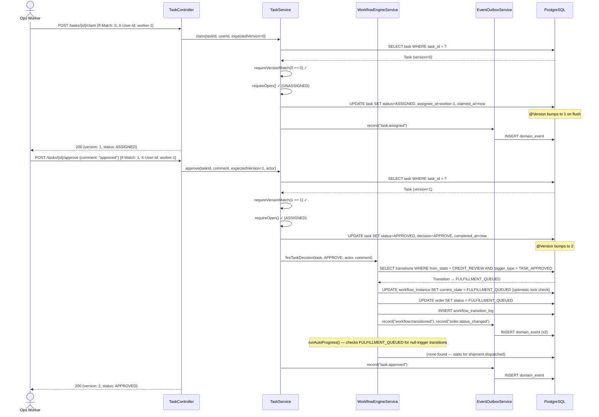

---

### 7.6 Task Reject

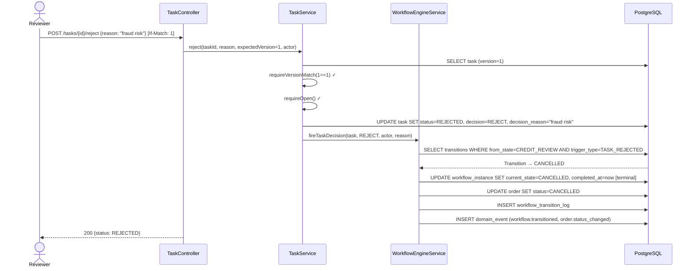

---

### 7.7 Task Escalation (Manual)

A supervisor manually escalates a task before the SLA fires. Reason is required at the API level (returns 400 if blank).

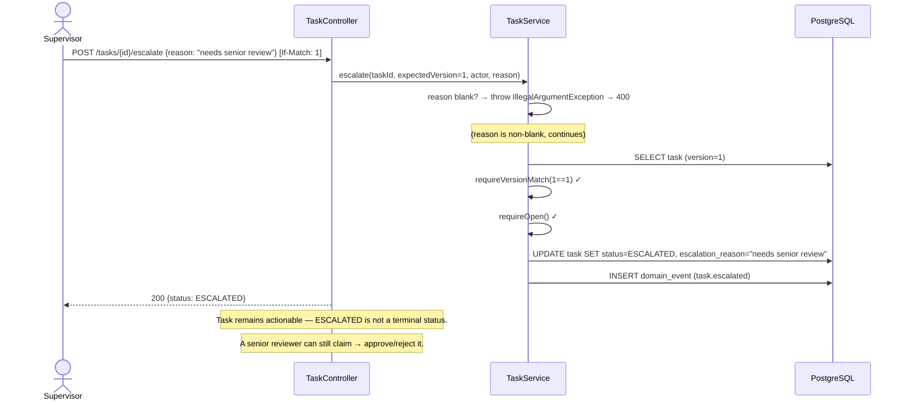

---

### 7.8 SLA Sweep — Automatic Escalation

A `@Scheduled` job runs every 30 seconds (configurable via `oms.task.sla-sweep-interval-ms`). It escalates any non-terminal task whose `sla_due_at` has passed.

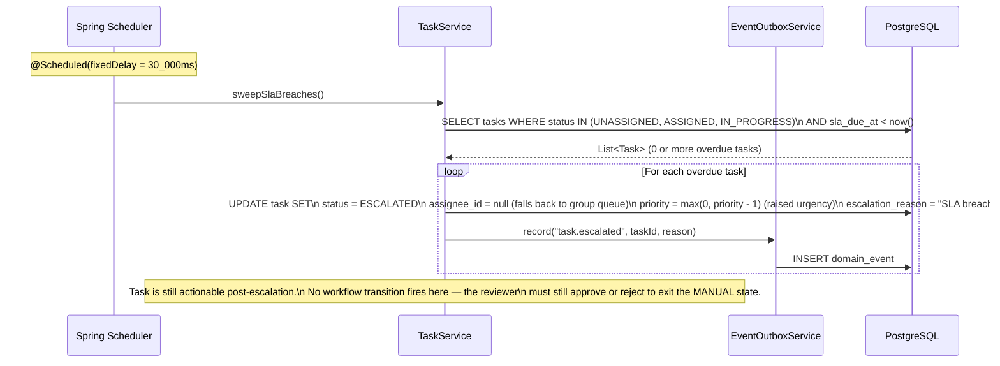

---

### 7.9 Publish Workflow Definition

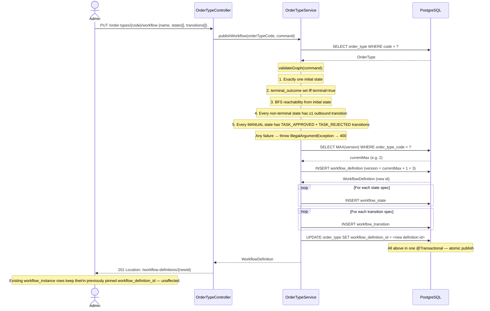

---

### 7.10 Optimistic Lock Conflict

Two users attempt to update the same order or task concurrently. The second write is rejected.

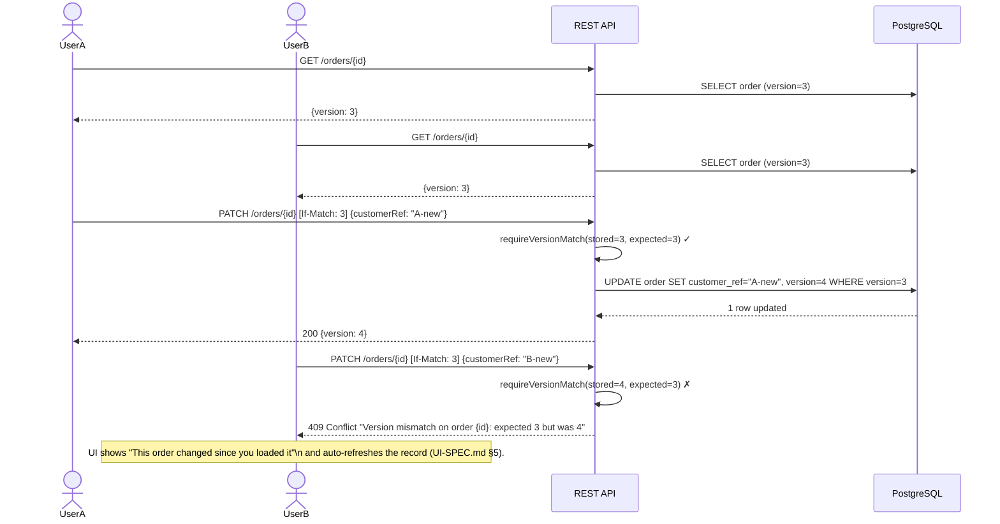

---

### 7.11 Transactional Outbox — Event Delivery

Domain events are written to the `domain_event` table in the **same DB transaction** as the state change, eliminating dual-write hazards. A separate publisher process delivers them to the message bus.

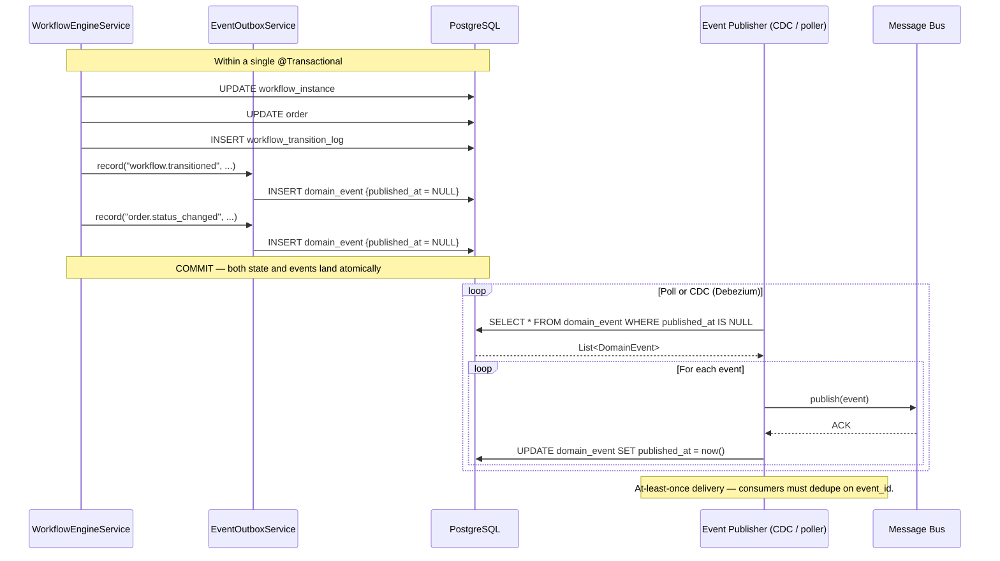

---

### 7.12 Order Schema Extension (PATCH)

Adding a new field to an existing order type — no DDL, no deploy required.

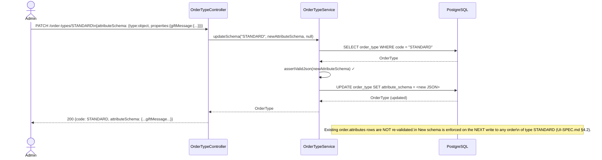

---

## 8. Workflow Engine Deep Dive

### State Types

| Type | Engine behavior | Task created? | Exit mechanism |
|---|---|---|---|
| `AUTOMATIC` | Immediately evaluates outbound transitions in `sequence` order; fires the first one whose trigger matches and guard passes. | No | External event or null-trigger transition. |
| `MANUAL` | Same evaluation logic as AUTOMATIC, but first creates a `task` row on entry. | **Yes** | Only via `TASK_APPROVED` or `TASK_REJECTED` trigger from a task decision. |
| `WAIT` | Identical evaluation to AUTOMATIC. The type is a monitoring hint — alerting systems can set different SLAs for WAIT states. | No | External event or null-trigger transition. |

### Transition Evaluation Order

For a given `from_state`, the engine selects among outbound transitions by:

1. Match `trigger_type` and `trigger_code` (or `trigger_code IS NULL` for auto-fire).
2. Evaluate `guard_expression` via `GuardEvaluator` against the order context.
3. Fire the **first** transition (lowest `sequence` value) where both conditions pass.

This is how multi-branch states work (e.g., `PAYMENT_PENDING` has a guard-only `CREDIT_REVIEW` branch at sequence=0 and a `payment.captured` branch at sequence=1).

### Workflow Versioning

```
order_type.workflow_definition_id  ←──── the ONLY "active version" pointer
       │
       ▼
workflow_definition (version N)
       │
       ├── workflow_state (CREATED, PAYMENT_PENDING, ...)
       └── workflow_transition (CREATED→PAYMENT_PENDING on order.submitted, ...)

workflow_instance (per order)
       └── workflow_definition_id  ←── pinned at order creation time, NEVER changes
```

Publishing a new workflow version (`PUT /order-types/{code}/workflow`) inserts a new `workflow_definition` row and atomically updates `order_type.workflow_definition_id`. All existing `workflow_instance` rows remain pinned to their original version.

### Standard Workflow State Diagram

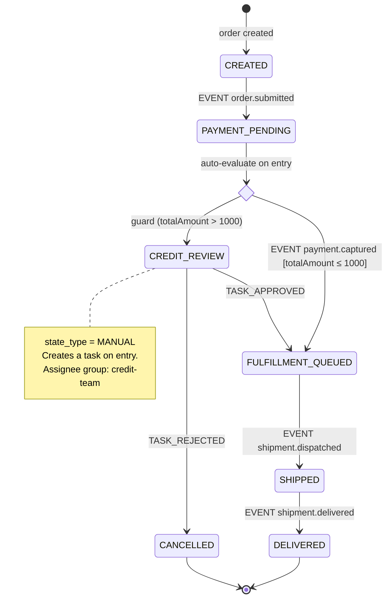

---

## 9. Human Task Queue

### Task Lifecycle State Machine

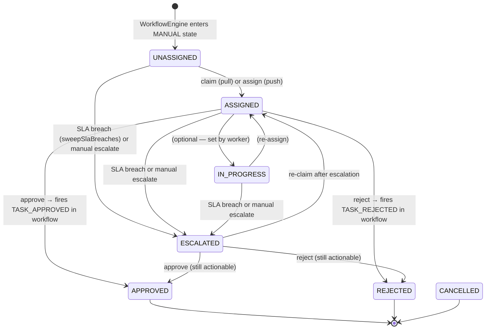

### Task Fields Reference

| Field | Set when | Notes |
|---|---|---|
| `assignee_group` | Task created | Copied from `workflow_state.default_assignee_group`. Supports pull (anyone in the group claims) or push (lead assigns directly). |
| `assignee_id` | `claim` or `assign` | Null for group-queued tasks. |
| `sla_due_at` | Task created | `now() + oms.task.default-sla-hours` (default 24h, configurable). |
| `decision` / `decision_reason` | `approve` / `reject` | Stored for audit; `decision_reason` appears in Order Detail's workflow history. |
| `escalation_reason` | `escalate` or SLA sweep | Distinct from `decision_reason`. Required for manual escalation (400 if blank). System fills it automatically on SLA breach. |
| `version` | Every mutation | Independent optimistic lock from `order.version`. |

---

## 10. Event System

### Emitted Events

| Event | Aggregate | Payload fields |
|---|---|---|
| `order.created` | ORDER | `orderId`, `orderTypeCode`, `occurredAt`, `triggeredBy` |
| `order.updated` | ORDER | `orderId`, `occurredAt`, `triggeredBy` |
| `order.status_changed` | ORDER | `orderId`, `fromStatus`, `toStatus`, `occurredAt`, `triggeredBy` |
| `workflow.transitioned` | WORKFLOW_INSTANCE | `orderId`, `orderTypeCode`, `fromState`, `toState`, `occurredAt`, `triggeredBy` |
| `task.created` | TASK | `taskId`, `orderId`, `taskType`, `assigneeGroup`, `occurredAt` |
| `task.assigned` | TASK | `taskId`, `assigneeId`, `occurredAt` |
| `task.approved` | TASK | `taskId`, `occurredAt`, `triggeredBy` |
| `task.rejected` | TASK | `taskId`, `occurredAt`, `triggeredBy` |
| `task.escalated` | TASK | `taskId`, `reason`, `occurredAt` |

### Outbox Pattern

- Every `record()` call in `EventOutboxService` writes a `domain_event` row with `published_at = NULL`.
- The call **must** happen inside the caller's existing `@Transactional` scope — the outbox row commits atomically with the state change.
- A separate publisher (poller or CDC via Debezium) queries `WHERE published_at IS NULL`, delivers to the broker, then sets `published_at = now()`.
- Consumers must dedupe on `event_id` because at-least-once delivery can produce redeliveries on publisher crash.

---

## 11. Frontend Architecture

### Page Inventory

| Route | Page | Console | Key API calls |
|---|---|---|---|
| `/ops/orders` | OrderListPage | Ops | `GET /orders`, `GET /order-types/status-taxonomy` |
| `/ops/orders/new` | OrderCreatePage | Ops | `GET /order-types`, `GET /order-types/{code}/schema`, `POST /orders` |
| `/ops/orders/:id` | OrderDetailPage | Ops | `GET /orders/{id}`, `GET /orders/{id}/workflow`, `POST /orders/{id}/workflow/transitions` |
| `/ops/tasks` | TaskQueuePage | Ops | `GET /tasks` |
| `/ops/tasks/:id` | TaskDetailPage | Ops | `GET /tasks/{id}`, `POST /tasks/{id}/claim`, `POST /tasks/{id}/approve`, `POST /tasks/{id}/reject`, `POST /tasks/{id}/escalate`, `POST /tasks/{id}/comments` |
| `/track/:orderId` | OrderTrackingPage | Customer | `GET /orders/{id}`, `GET /orders/{id}/workflow` |
| `/admin/order-types` | OrderTypeListPage | Admin | `GET /order-types` |
| `/admin/order-types/new` | OrderTypeEditorPage | Admin | `POST /order-types`, `PUT /order-types/{code}/workflow` |
| `/admin/order-types/:code/workflow` | WorkflowDesignerPage | Admin | `GET /workflow-definitions/{id}`, `PUT /order-types/{code}/workflow` |

### Component Hierarchy

```
App (React Router)
├── OpsAdminLayout
│   ├── OrderListPage
│   │   ├── StatusBadge
│   │   ├── Pagination
│   │   └── useStatusTaxonomy (hook → GET /order-types/status-taxonomy)
│   ├── OrderCreatePage
│   │   └── DynamicSchemaForm   (renders inputs from JSON Schema)
│   ├── OrderDetailPage
│   │   ├── StatusBadge
│   │   ├── ConflictBanner      (409 handling)
│   │   └── DynamicSchemaForm   (attributes read-only view)
│   ├── TaskQueuePage
│   │   └── SlaBadge            (green/amber/red by SLA remaining)
│   ├── TaskDetailPage
│   │   ├── SlaBadge
│   │   └── ConflictBanner
│   ├── OrderTypeListPage
│   ├── OrderTypeEditorPage
│   │   └── SchemaBuilder       (field-by-field JSON Schema editor)
│   └── WorkflowDesignerPage
│       └── workflowGraph.ts    (canvas state: nodes + edges)
└── CustomerLayout
    └── OrderTrackingPage
        └── StatusBadge (customer-facing label, customer-visible states only)
```

### API Client Layer

All fetch calls go through `web/src/lib/api.ts` (a thin fetch wrapper):
- Base URL resolved by Vite proxy (`/orders` → `http://localhost:8080/orders`).
- `X-User-Id` injected from `actingUser` context (set in `OpsAdminLayout`).
- `If-Match` headers manually threaded through action calls.
- `409 Conflict` surfaces as a thrown error the caller catches; `ConflictBanner` renders the message.

### Dynamic Schema Form

`DynamicSchemaForm` reads `order_type.attribute_schema` (JSON Schema) and renders:

| JSON Schema | Widget |
|---|---|
| `type: string` | `<input type="text">` |
| `type: string, format: date` | `<input type="date">` |
| `type: number` / `integer` | `<input type="number">` |
| `type: boolean` | `<input type="checkbox">` |
| `enum: [...]` | `<select>` |

`x-show-in-task: true` vendor extension causes the field to appear in Task Detail's context panel (§2.4 of UI-SPEC). `x-customer-visible: true` is stored but not yet consumed in any UI (reserved for a future customer portal attributes screen).

---

## 12. Concurrency & Consistency

### Optimistic Locking Summary

| Resource | Lock column | Updated by |
|---|---|---|
| `order` | `version` | `OrderService.updateOrder`, `WorkflowEngineService.applyTransition` |
| `workflow_instance` | `version` | `WorkflowEngineService.applyTransition` |
| `task` | `version` | `TaskService.claim`, `.assign`, `.approve`, `.reject`, `.escalate` |
| `order_line` | `version` | `OrderService.updateLine` |

All three locks (`order.version`, `workflow_instance.version`, `task.version`) may be touched in a single transaction (e.g., task approve updates all three). They are independent — a `409` on a task action is always "this task changed", not "this order changed."

### Status Consistency Invariant

`order.status` is written **only** by `WorkflowEngineService.applyTransition` (and `startInstance`). `PATCH /orders/{id}` never touches `status`. This means `order.status` always mirrors `workflow_instance.current_state.code` and can be trusted as a fast read-optimized projection without joining workflow tables.

### Workflow Definition Immutability

`workflow_definition` rows are immutable once published (no `UPDATE` path exists). "Editing" a workflow always produces a new row with a new `version`. The `order_type.workflow_definition_id` FK is the only mutable pointer; repointing it atomically in one transaction is the publish operation.

### In-Flight Order Protection

```
Time 0: order created → workflow_instance.workflow_definition_id = V1
Time 1: admin publishes V2 → order_type.workflow_definition_id = V2
Time 2: new orders pick up V2; existing order still runs on V1 (pinned)
```

No in-flight order can be silently affected by a workflow edit. Orders complete on the version they started on, always.
